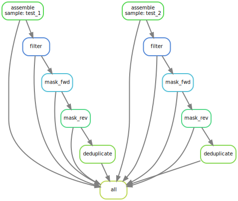

# T/B cell repertoires profiling 

<div align=center></div>


```bash
usage: tbpi [-h] [-v]  ...

   ████████╗██████╗░██████╗░██╗
   ╚══██╔══╝██╔══██╗██╔══██╗██║
   ░░░██║░░░██████╦╝██████╔╝██║
   ░░░██║░░░██╔══██╗██╔═══╝░██║
   ░░░██║░░░██████╦╝██║░░░░░██║
   ░░░╚═╝░░░╚═════╝░╚═╝░░░░░╚═╝

Omics for All, Open Source for All

TCR/BCR sequence analysis pipeline

optional arguments:
  -h, --help     show this help message and exit
  -v, --version  print software version and exit

available subcommands:
  
    init         init project
    bcr_wf       BCR analysis pipeline
    tcr_wf       TCR analysis pipeline
```
